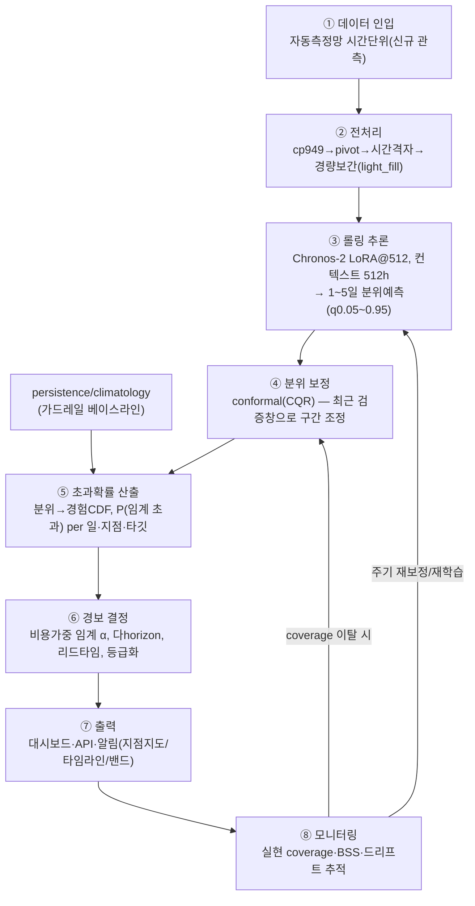

# Chronos-2 기반 동적 수질오염 예측·경보 시스템 — 구축 설계서

> 📌 **이 문서는 [`README.md`](README.md)(마스터 통합본)의 설계 근거 부록입니다.** 본 설계서는 구현 전 청사진이며, **실제 구현·검증은 완료**되었습니다 → 코드 `src/system/`([`src/system/README.md`](src/system/README.md)), 운영 결과는 README §4(전 67지점 replay 검증). 설계 대비 결정: 모델은 전 타깃 **LoRA ctx512**로 확정(ctx1024 후보는 게이트·broad-test 미확인으로 롤백).

> 목적: 실험에서 검증된 **Chronos-2(LoRA@512) + conformal 보정 분위예측**을 운영 가능한 **동적 확률 경보 시스템**으로 구축.
> 핵심 가치: 점추정이 아니라 **"향후 1~5일 내 수질 임계 초과 확률"** 을 보정된 형태로 산출 → **사전 경보 + 리드타임 + 비용가중 의사결정**.

---

## 1. 설계 원칙 (실험 결론 반영)

1. **베이스라인 위 견고성**: persistence가 강하므로, 운영에서도 persistence/climatology를 **상시 동반 비교**해 모델이 가치를 줄 때만 신뢰(자동 가드레일).
2. **용도별 타깃 운용**: 점추정 신뢰 = DO·T-N(·TOC); **Chl-a·T-P는 "경보(이벤트)" 중심**으로 사용(점추정 부적합·경보 유용).
3. **확률은 반드시 보정**: 원분위는 과신(cov80≈0.75) → **conformal(CQR) 온라인 보정**을 파이프라인에 내장(목표 cov 정렬).
4. **다지점 일괄·저자원**: Chronos는 1모델로 전 67지점 배치 추론(VRAM ≤3GB) → 단일 GPU로 전국 운영 가능.
5. **무편향 유지**: |PBIAS|<2% 확인된 모델 → 임계 부근 체계적 오경보 최소.

---

## 2. 시스템 아키텍처

---

## 3. 구성요소 상세

### ① 데이터 인입
- 소스: 자동측정망 시간단위(운영 시 실시간/배치 적재). 스키마는 본 프로젝트 `src/data/sources.py`(cp949·LONG·항목코드 매핑) 재사용.
- 신규 관측을 지점별 시계열 버퍼(최근 ≥512h)로 유지.

### ② 전처리 (재사용: `sources.py`, `to_chronos.light_fill`)
- LONG→wide pivot(10채널), 시간격자 정렬, 항목코드 coalesce.
- 컨텍스트 결측은 **경량 선형보간+ffill**(모델 비편향). 관측 마스크 보존(평가/모니터링용).

### ③ 롤링 추론 (재사용: `src/chronos/`)
- 모델: `Chronos2Pipeline.from_pretrained(models/chronos_lora512_{target}/finetuned-ckpt)`.
- 매 발령주기(예: 매일 1회 또는 매시)마다 각 지점 최근 512h를 컨텍스트로 **1~5일(120h) 분위예측**, `quantile_levels=[0.05,0.1,0.25,0.5,0.75,0.9,0.95]`.
- 전 67지점 배치(`predict_quantiles`, batch). 타깃별 어댑터 5개 순회(또는 다변량 1회).
- **가드레일**: 동일 시점 persistence·climatology도 계산해 최근 성능이 베이스라인 미달이면 해당 지점·타깃을 "저신뢰" 플래그.

### ④ 분위 보정 — conformal (재사용: `src/eval/final_eval.cqr`)
- 최근 N일(롤링 검증창)의 (예측분위, 실관측)으로 CQR 적합도점수 산출 → 80%/90% 구간을 조정.
- 효과(검증됨): cov80 0.75→0.79, cov90 0.85→0.90. **운영 중 실현 coverage가 목표를 벗어나면 검증창을 갱신해 자동 재보정.**

### ⑤ 초과확률 산출 (재사용: `src/alert/thresholds.exceed_prob_from_quantiles`)
- 보정된 분위 → 경험적 CDF 선형보간 → `P(값 > 임계)`(DO는 `P(값 < 임계)`), 일별·horizon별.
- 임계 정의(`src/alert/thresholds.py`): **하천 생활환경 기준 등급 경계 + 조류 우려기준**(절대), 규제기준이 무의미한 지점은 **지점 분위 임계(상/하위 10%)** 자동 대체(상대 이상치).

### ⑥ 경보 결정 정책 (재사용/확장: `src/alert/policy.py`)
- 발령 규칙: `P(초과) ≥ α` → 경보. **α는 비용가중 최적화**(미탐지 vs 오경보 비용비로 검증창에서 결정; 타깃·지점별).
- **다horizon**: 1~5일 각각에 대해 발령 → "가장 이른 초과 예상일 = 리드타임" 제공.
- **등급화**: 확률대(예: 관심 0.3 / 주의 0.5 / 경계 0.7)로 단계 경보.
- 타깃 운용: Chl-a·DO·T-N은 경보 신뢰, T-P는 보조(약함 명시).

### ⑦ 출력
- **대시보드**: 지점 지도(현재 위험확률 색), 지점별 타임라인(관측·중앙값·80/90% 밴드·임계선·경보마커 — 본 프로젝트 `final_*`·`alert_timeline_*` 그림 양식), 다horizon 위험표.
- **API**: `GET /risk?station&target&horizon` → {median, q10, q90(보정), P_exceed, alert_level, lead_day}.
- **알림**: 임계 등급 상승 시 담당기관 푸시(이메일/메신저), 근거(밴드·확률·리드타임) 첨부.

### ⑧ 모니터링 & 재학습
- **실시간 스코어카드**: 관측 도착 시 실현 NSE/RSR·CRPS-skill·**실현 coverage**·경보 BSS/PR-AUC를 롤링 집계(가드레일).
- **드리프트 감지**: 입력 분포·실현 coverage·CRPS-skill 저하 시 경보.
- **재보정**(경량·잦음): conformal 검증창 갱신(④).
- **재학습**(무거움·드뭄, 분기/반기): 신규 데이터로 LoRA@512 재적합(`run_ctx512` 흐름), 검증셋 성능 게이트 통과 시 배포(블루-그린).

---

## 4. 모델 구성 (타깃 적합도 반영)

| 타깃 | 운영 모드 | 주지표(SLO 예시) |
|---|---|---|
| DO | 점추정+경보 | NSE≥0.7, 실현 cov80 0.78~0.82 |
| T-N | 점추정+경보 | NSE≥0.6, PR-AUC≥0.7 |
| TOC | 점추정(보수)+경보 | NSE≥0.5 |
| T-P | 경보 보조 | 점추정 참고용, 경보 약함 표시 |
| Chl-a | **경보 중심(녹조)** | PR-AUC≥0.7, BSS≥0.3, 리드타임 보고 |

---

## 5. 운영(자원·스케줄)
- **자원**: 단일 GPU(≤4GB VRAM)로 전 67지점·5타깃·5horizon 배치 추론 수초~수십초.
- **주기**: 자동측정망 시간단위 → 매시 또는 매일 발령. 컨텍스트 512h만 유지하면 됨.
- **지연**: 인입→경보 분 단위 목표. 보정/초과확률/정책은 경량(CPU).
- **이중화**: 가드레일(persistence) 항상 병행 → 모델 장애 시 폴백.

---

## 6. 단계적 구축 로드맵
1. **MVP(2~3주)**: 배치 추론(④⑤⑥) + 정적 대시보드/CSV 경보. 기존 `run_ctx512`·`alert.py`·`final_eval.cqr` 조립.
2. **운영화(1~2개월)**: 실시간 인입 파이프라인, API, 온라인 conformal 재보정, 모니터링 스코어카드.
3. **고도화**: 다horizon 등급경보, 비용가중 α 자동최적화, 드리프트 알림, 분기 재학습 자동화, 전 67지점 확장·신규지점 zero-shot 폴백.
4. **확장 연구 연계**: 미래 known covariate(댐 방류계획·캘린더)로 `future_covariates`, 여름 Chl-a 기상연계 트랙, conformal 고도화.

---

## 7. 기존 코드 자산 → 시스템 매핑
| 시스템 단계 | 재사용 모듈 |
|---|---|
| 전처리 | `src/data/sources.py`, `src/chronos/to_chronos.py` |
| 추론 | `src/chronos/run_ctx512.py`(어댑터 로드/예측), `models/chronos_lora512_*` |
| 보정 | `src/eval/final_eval.py::cqr` |
| 초과확률·임계 | `src/alert/thresholds.py` |
| 경보결정·평가·시각화 | `src/alert/alert.py`(policy/eval/timeline) |
| 모니터링 지표 | `src/eval/metrics.py`, `metric_audit.py`, `final_eval.py` |

---

## 8. 리스크 & 완화
- **신뢰구간 과신** → conformal 온라인 보정 + 실현 coverage SLO 감시.
- **persistence 미달 구간** → 가드레일 폴백·저신뢰 플래그.
- **T-P/Chl-a 점추정 약함** → 경보 중심 운용·약함 명시.
- **분포 드리프트(기후·오염원 변화)** → 드리프트 감지 + 주기 재학습.
- **데이터 결측·지연** → light_fill + 마스크 기반 저신뢰 표기.
- **규제기준 부재 타깃** → 분위 임계(상대) 명시적 구분.
