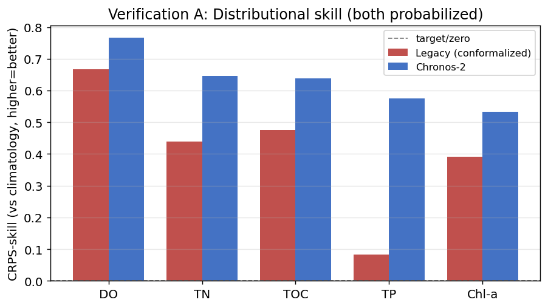
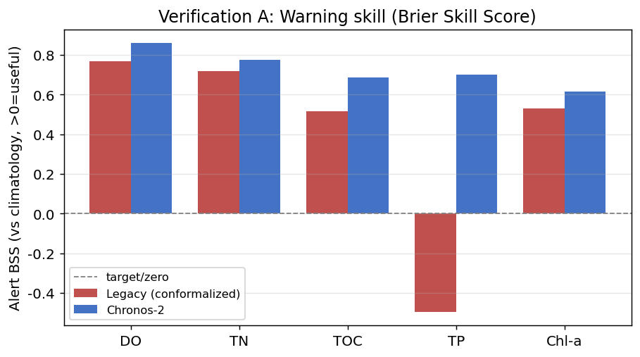
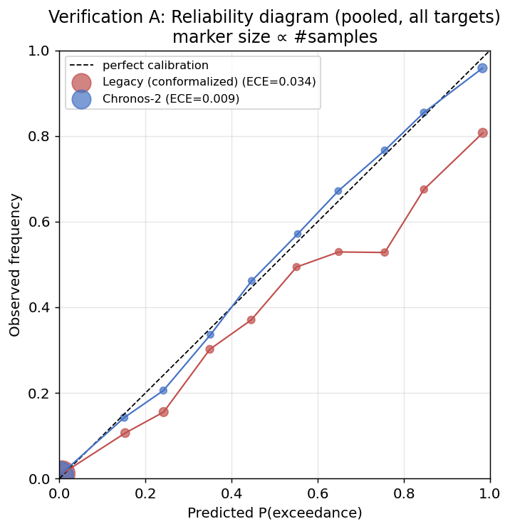
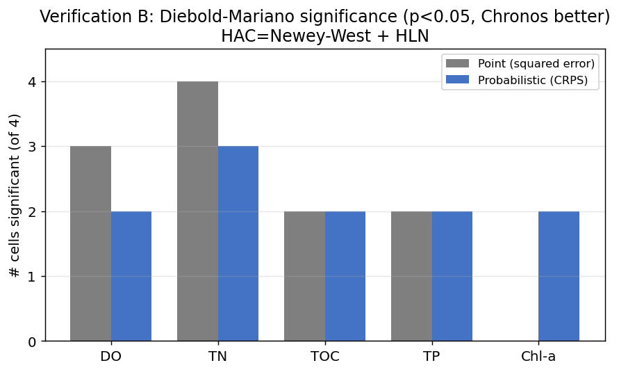
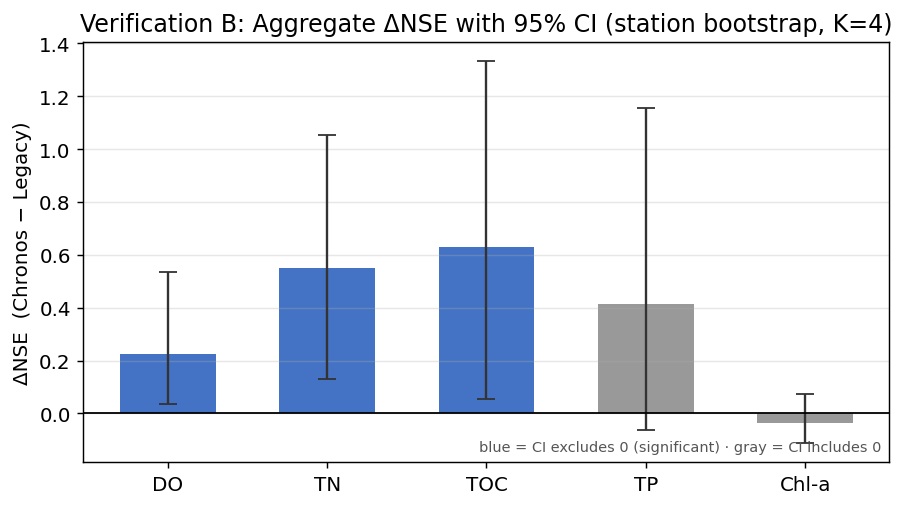
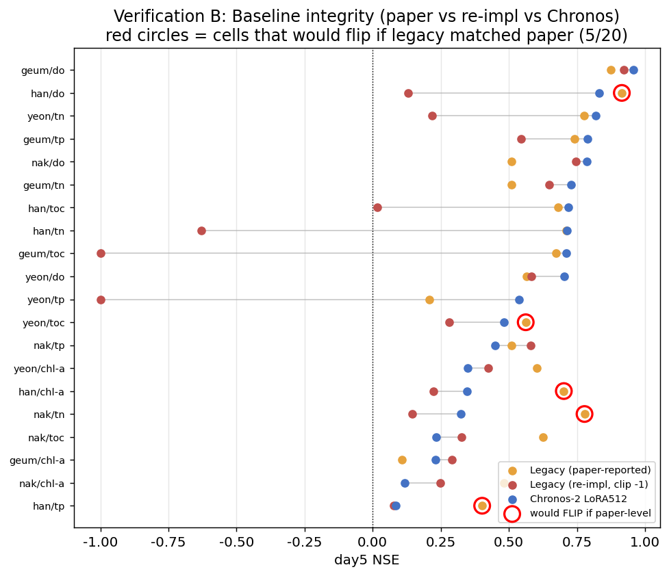

# 독립 검증 요약 (`VERIFICATION.md`)

> **이 문서는 기존 결론(README/FINAL_REPORT/SYSTEM_DESIGN)을 수정하지 않는 별도 부록입니다.**
> 저장된 예측 산출물(`reports/predictions/*`)만으로 두 가지 독립 검증을 수행해, 핵심 주장
> "Chronos-2가 고전 모델(GAIN+GRU)을 능가한다"의 **공정성·유의성·견고성**을 재평가했습니다.
> 기존 코드·표·문서는 일절 변경하지 않았고, 신규 산출만 추가했습니다.

- 재현: `python -m src.eval.prob_compare` · `python -m src.eval.robustness_check`
- 산출: 본 문서 + `reports/prob_compare.md` + `reports/robustness_check.md` + `reports/tables/prob_compare_*.csv` + `reports/tables/robustness_*.csv`

---

## 0. 검증 동기 (제기된 방법론적 우려)

1. **점 vs 확률 비대칭**: 레거시는 점예측, Chronos는 확률분위 예측인데 NSE(중앙값) 단순비교는
   (i) Chronos의 분포를 한 점으로 눌러 **보수적**이고, (ii) 평균회귀에 후한 지표라 **꼬리(임계초과)
   예보 능력**을 못 본다.
2. **통계적 유의성 부재**: 기존 비교는 단일 실행 점추정. 시드·표본 변동에 견고한지, 차이가
   우연이 아닌지(유의성) 확인되지 않았다.
3. **베이스라인 strawman 위험**: 레거시가 원논문 대비 크게 약하게 재구현됐다면, "능가"가
   약화된 상대 덕일 수 있다.

→ 검증 A(`prob_compare`)는 우려 1을, 검증 B(`robustness_check`)는 우려 2·3을 정량화한다.

---

## 1. 검증 A — 확률·예보 차원의 공정한 직접 맞대결

**방법**: 레거시 점예측을 **인과 잔차분위(online conformal)** 로 확률화하여 두 모델 모두에
예측분포를 부여(누수 0, 레포 conformal 철학과 동일). 그 뒤 동일 origin·관측·임계에서
CRPS·coverage·경보 BSS/PR-AUC/F1/리드타임을 비교(대표 4지점·전 horizon, 평가행 36,902).

### 1.1 분포 품질
| 타깃 | CRPS-skill 레거시→Chronos | cov80 leg/chr | NSE leg/chr |
|---|---|---|---|
| DO | 0.668 → **0.767** | 0.76 / 0.74 | 0.74 / 0.90 |
| T-N | 0.439 → **0.647** | 0.77 / 0.83 | 0.45 / 0.79 |
| TOC | 0.475 → **0.638** | 0.74 / 0.79 | 0.34 / 0.78 |
| T-P | 0.083 → **0.575** | 0.75 / 0.84 | 0.55 / 0.71 |
| Chl-a | 0.391 → **0.534** | 0.75 / 0.77 | 0.45 / 0.49 |

### 1.2 예보(경보) 능력
| 타깃 | BSS 레거시→Chronos | PR-AUC leg/chr | recall leg/chr |
|---|---|---|---|
| DO | 0.77 → **0.86** | 0.90 / 0.96 | 0.83 / 0.88 |
| T-N | 0.72 → **0.77** | 0.92 / 0.91 | 0.80 / 0.84 |
| TOC | 0.52 → **0.68** | 0.73 / 0.86 | 0.75 / 0.86 |
| **T-P** | **−0.50 → 0.70** | 0.35 / 0.88 | 0.76 / 0.81 |
| Chl-a | 0.53 → **0.62** | 0.80 / 0.86 | 0.82 / 0.87 |

### 1.3 결론(A)
- **출발선을 맞춰도(둘 다 확률화) Chronos가 전 5타깃에서 CRPS-skill·경보 BSS 우위.**
  "비교가 불공정해서 이겼다"는 반론을 데이터로 반박한다.
- **T-P가 결정적**: 점 NSE는 0.55 vs 0.71로 접전이나 경보 BSS는 레거시 −0.50(기후값보다 나쁨)
  vs Chronos 0.70 → **점 비교가 가린 예보능력 격차**.
- **정직한 뉘앙스**: coverage만으로는 두 모델이 잘 안 갈린다(conformal이 어떤 점모델에도
  coverage를 보장). 진짜 차이는 **CRPS(보정 후 예리성)** 와 **이벤트 판별력(BSS/PR-AUC)** 에 있다.

---

## 2. 검증 B — 통계적 유의성·견고성 감사

**방법**: 저장된 예측의 per-sample 손실 시계열로 (day5 기준, 대표 4지점)
- **Diebold-Mariano 검정**: 손실차의 자기상관(lag1≈0.72 실측)을 **HAC=Newey-West + HLN
  소표본보정**으로 처리. 점추정=제곱오차, 확률=per-sample CRPS.
- **부트스트랩**: 셀내 이동블록(자기상관 보존) + 지점수준(K=4) 집계 CI.
- **베이스라인 감사**: 원논문 vs 재구현 NSE 격차, 원논문값이면 역전되는 셀 식별.

### 2.1 유의성 (p<0.05 & Chronos 우위 = 유의)
| 타깃 | 점추정 유의/전체 | CRPS 유의/전체 |
|---|---|---|
| DO | 3/4 | 2/4 |
| T-N | 4/4 | 3/4 |
| TOC | 2/4 | 2/4 |
| T-P | 2/4 | 2/4 |
| **Chl-a** | **0/4** | 2/4 |
| **합계** | **11/20** | **11/20** |

> Chronos 우위는 **약 55% 셀에서만 통계적으로 유의** → 보편적이지 않고 타깃·지점 의존.
> Chl-a는 점추정 0/4지만 CRPS 2/4 → **녹조 가치는 점추정이 아닌 확률에 있음**을 통계가 입증.

### 2.2 집계 ΔNSE 신뢰구간 (지점수준 K=4)
| 타깃 | ΔNSE(Chr−Leg) | 95% CI | 0 배제? |
|---|---|---|---|
| DO | 0.224 | [0.037, 0.536] | ✅ |
| TOC | 0.630 | [0.055, 1.333] | ✅ |
| T-N | 0.551 | [0.129, 1.052] | ✅ |
| T-P | 0.414 | [−0.062, 1.155] | ❌ |
| Chl-a | −0.036 | [−0.113, 0.073] | ❌ |

> K=4 지점뿐이라 CI가 매우 넓다 = **표본 협소성의 정직한 노출**. 셀내 이동블록 부트스트랩에서는
> 11/20 셀이 0을 배제. "전국 67지점 일반화"는 통계적 근거가 약함.

### 2.3 베이스라인 정합성 감사 (strawman 위험)
- 재구현 레거시는 원논문 대비 **중앙값 0.29 NSE 낮음**(발산셀 1개 = 영산 T-P, NSE≈−1.2억).
- Chronos > 재구현 레거시: **15/20** · Chronos > 원논문 레거시: **11/20**.
- ⚠️ **원논문 성능이었다면 결론이 역전되는 셀: 5/20** (한강 DO·T-P·Chl-a, 낙동 T-N, 영산 TOC).

> 일부 결론이 **약화된 베이스라인에 의존**할 위험. 원논문 수치 기준 재검 또는 재구현 디버그 필요.

---

## 3. 종합 결론 (독립 검증 관점)

| 기존 주장 | 독립 검증 판정 |
|---|---|
| Chronos가 고전 모델을 능가 | **방향성 지지**(검증 A 전타깃 우위·다수 셀 유의) **그러나 보편적이지 않음**(11/20 유의) + 일부 strawman 의존(5/20 역전 가능) |
| 전국 67지점 일반화 | 비교가능한 4지점 CI가 넓어 **통계적 근거 약함** → 전 67지점 비교 필요 |
| Chl-a 녹조의 가치 | **점추정 아닌 확률 차원에서만 유의** → 기존 설계 철학(경보 중심)을 통계로 입증 |

**한 줄 요약**: Chronos의 우위는 *방향적으로 견고하고 확률·예보 차원에서 더 분명*하지만,
*통계적 유의성은 부분적이고 표본은 협소하며 일부는 약화된 베이스라인에 의존*한다.
기존 prose의 확신을 **사실로 못박으려면 아래 보완이 필요**하다.

---

## 4. 그림 (Figures)

> `python -m src.eval.make_verification_figures` 로 재생성. 라벨은 영문(컨테이너 한글폰트 부재).

**검증 A — 확률·예보**
| | |
|---|---|
|  |  |
| 분포 skill: 둘 다 확률화해도 Chronos가 전 타깃 우위 | 경보 BSS: T-P는 레거시 음수, Chronos 양수 |

신뢰도 곡선: Chronos(ECE=0.009)는 대각선에 밀착, 레거시(ECE=0.034)는 대각선 아래(과신).

**검증 B — 유의성·견고성**
| | |
|---|---|
|  |  |
| DM 유의 셀: 점추정 11/20·CRPS 11/20(Chl-a 점추정 0/4) | 집계 ΔNSE: DO/TN/TOC만 CI가 0 배제, TP/Chl-a는 불확실 |

베이스라인 정합성: 빨간 원 5개 = 레거시가 원논문 성능이었다면 Chronos가 졌을 셀.

---

## 5. 한계 & 권장 후속 (영향 큰 순)

1. **레거시 정합성 해소**(최우선): 원 TF 모델 직접 실행 또는 재구현 디버그로 strawman 의혹 제거.
   현 클라우드 환경은 GPU·원본데이터 부재로 불가 → 로컬/원 환경에서 수행.
2. **전 67지점으로 확장**: 레거시 예측을 전 지점 생성해 4지점 한계 탈피(시스템 replay는 이미 67지점).
3. **강한 확률 베이스라인 추가**: climatology를 넘어 seasonal-quantile·persistence+잔차분위 대비 평가.
4. **보고 위생**: day별 전체·mean/median 병기, 규제임계 vs 분위임계 분리 보고, 비용비 민감도 분석.
5. **본 검증의 자체 한계**: 4지점·단일 예측본·등분산 잔차 가정 → 위 1·2로 함께 해소.

---

*독립 검증 산출: `src/eval/prob_compare.py`, `src/eval/robustness_check.py`, `src/eval/make_verification_figures.py` (기존 자산 불가침).*
